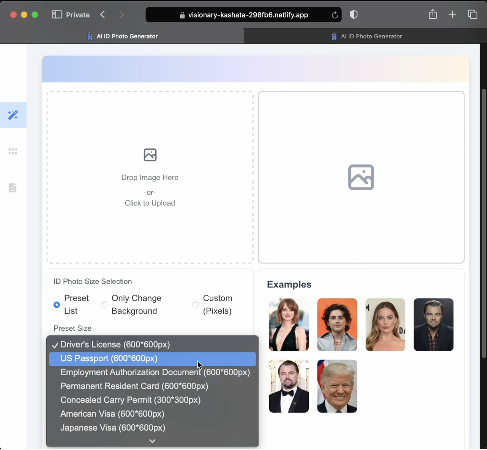
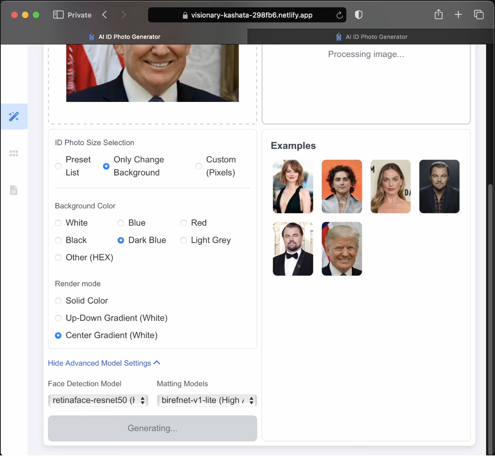
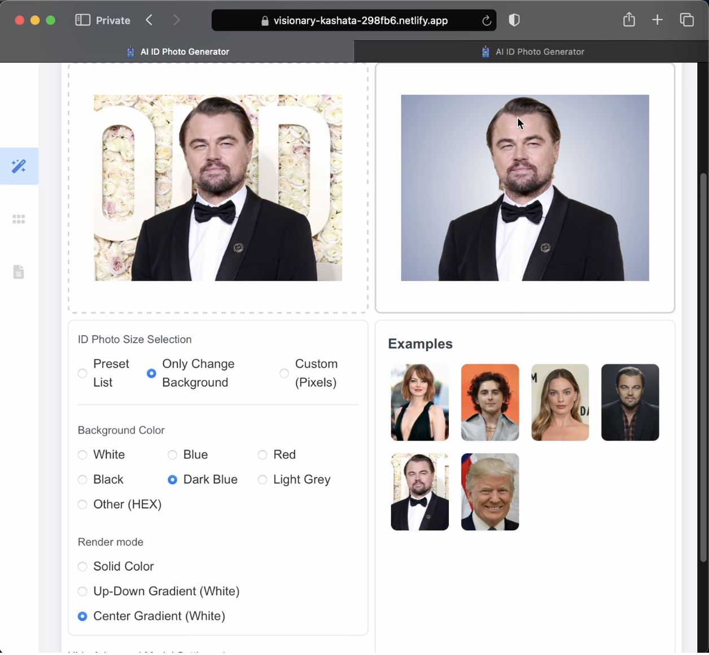
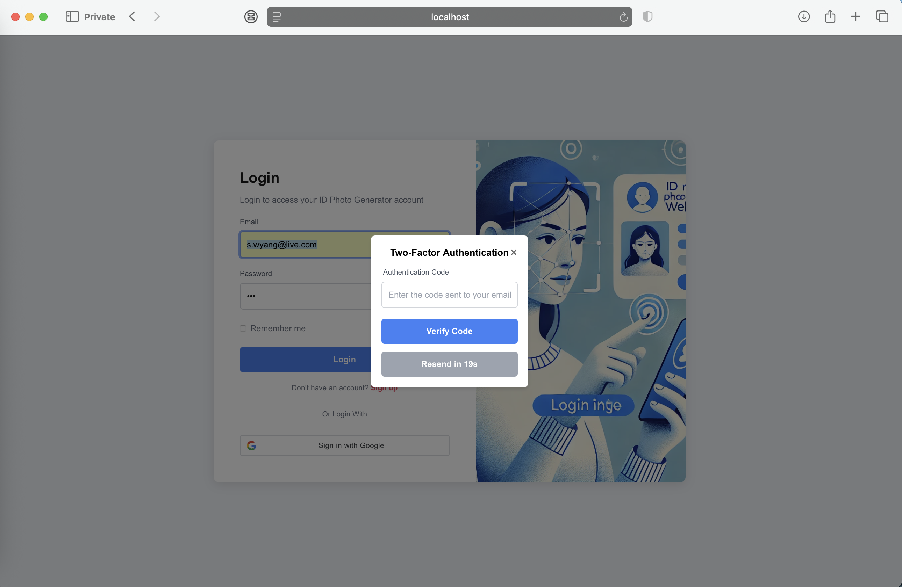
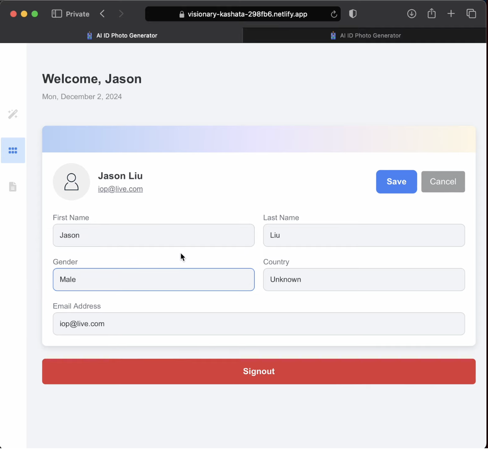
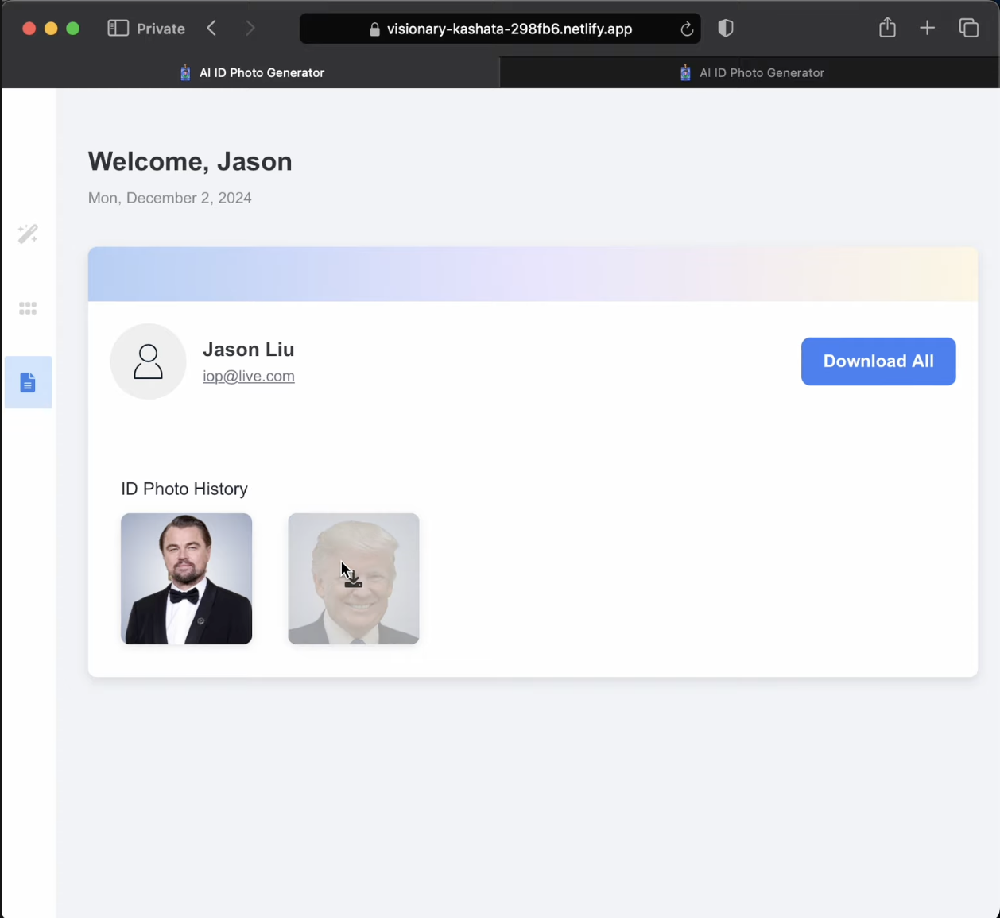
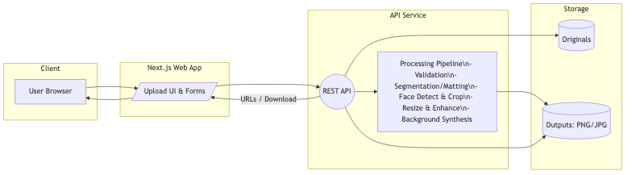

<!--
 * @Author: Audrey Yang 97855340+wyang10@users.noreply.github.com
 * @Date: 2025-11-15 23:58:46
 * @LastEditors: Audrey Yang 97855340+wyang10@users.noreply.github.com
 * @LastEditTime: 2025-11-16 14:46:58
 * @FilePath: /AI-Photo-Generator/README-1.md
 * @Description: 这是默认设置,请设置`customMade`, 打开koroFileHeader查看配置 进行设置: https://github.com/OBKoro1/koro1FileHeader/wiki/%E9%85%8D%E7%BD%AE
-->

<div align="center">

# 🪪 AI Photo Generator

</div>

End-to-end system for generating compliant ID photos from user uploads, featuring a production-style workflow from raw images → segmentation/matting → face-aligned cropping → background synthesis → standardized outputs via API + Web UI.

This project replicates the architecture used in real-world ID-photo services and demonstrates how to wrap open-source models such as **HivisionIDPhotos / MODNet / RMBG / BiRefNet / RetinaFace** into a modern **frontend + backend + model-processing** pipeline.

---

## Demo
| Generator Options | Processing | Before vs After |
|:----------------------:|:---------------:|:---------------:|
|  |  |  | 
| Two-Factor Authentication | User Profile | User History photos |
|  |  |  | 


---

## What I Built

* Designed a **full-stack ID-photo generation service**.
* Integrated open-source segmentation & face-detection models into a **unified pipeline**.
* Built **Next.js UI + Node.js API** with async job flow.
* Added **CPU stub mode** so anyone can clone & run locally.
* Deployed original version on **industrial GPU cluster** with remote inference.
* Structured the project like a **real production system**, not a classroom app.

---

## Problem

Given a user portrait photo, the system must:

* Remove background accurately.
* Detect, crop, and align faces.
* Generate ID-compliant output sizes, including:
    * 2×2 inch
    * 35×45 mm
    * US Visa / Passport / Driving License, etc.
* Allow background color options (white / blue / red / custom).
* Provide both a **REST API** and a **Next.js Web UI**.

---

## Key Features

* **✔ Full Production-Style Pipeline**
    * Upload ingestion & file validation
    * Segmentation / matting
    * Face detection & alignment
    * Cropping & resizing
    * Background synthesis
    * Export to PNG/JPG/DPI presets
* **✔ Modular Model Integration**
    * Supports plugging in various models: `MODNet`, `RMBG`, `BiRefNet`, `HivisionIDPhotos` pipeline
    * Face Detection support: `MTCNN`, `RetinaFace`, `Face++`
* **✔ Full Stack Implementation**
    * **Next.js (TS)** → Upload UI / templates / preview
    * **Node.js API** → Validation / processing orchestration
    * Optional Python bridge for GPU-accelerated models (`onnxruntime-gpu`)
* **✔ Developer-Friendly**
    * Clear API contract
    * Easy `.env` setup
    * Optional Docker / Compose
    * Ability to run **stub mode** for demos without GPU

---

## Architecture

### Architecture Diagram



### Component Breakdown

#### 🟦 Frontend (Next.js + TS)

  * Upload interface
  * Background/color/template selection
  * Output preview
  * Downloads
  * Handles only UI logic → no heavy processing

#### 🟩 Backend (Node.js)

  * Receives uploads
  * Validates inputs (size, ratio, EXIF)
  * Calls processing pipeline
  * Returns job status + URLs
  * Logs + error handling

#### 🟥 Model Layer

  * Optional Python service if GPU models are used
  * Unified interface: `processImage(inputPath, { bgColor, size, dpi })`

#### 🟨 Storage

  * Originals → `uploads/`
  * Final images → `outputs/`
  * Can be swapped for S3/GCS easily

-----

## 📁 Repository Structure

```
ai-photo-generator/
├─ ai_id_photo_backend_api/     # API service
├─ ai_id_photo_web_app/         # Next.js frontend
├─ docs/                        # Architecture, API docs, diagrams
├─ demos/                       # Sample inputs/outputs, demo video
├─ docker-compose.yml           # (Optional) multi-service dev setup
└─ scripts/                     # Helpers & tools
```

-----

## 🛠️ Tech Stack

| Component | Technology |
| :--- | :--- |
| **Frontend** | Next.js (TypeScript), React, Tailwind / custom design |
| **Backend** | Node.js (Express), Multer (file upload), Sharp (image transform), Optional Python (GPU models) |
| **Infra** | Docker / Compose, `.env` config, Cross-platform (macOS/Linux/Windows) |

-----

## ⚡ Quick Start

### 1\. Backend

```bash
cd ai_id_photo_backend_api
npm install
nodemon server.js
# Default: http://localhost:4000
```

### 2\. Frontend

```bash
cd ai_id_photo_web_app
npm install
npm run dev
# Open: http://localhost:3000
```

**Setup `.env.development`:**

```
NEXT_PUBLIC_REACT_APP_BASE_API_URL=http://localhost:4000
NEXT_PUBLIC_GOOGLE_CLIENT_ID=your-google-client-id
```

### 3\. Docker (Optional)

```bash
docker compose up --build
```

-----

## API Reference

| Method | Endpoint | Description |
| :--- | :--- | :--- |
| `POST` | `/api/v1/generate` | Generate ID photo from upload. |
| `GET` | `/api/v1/jobs/{job_id}` | Async job tracking. |
| `GET` | `/api/v1/templates` | Available output sizes. |
| `GET` | `/health` | Health probe. |

-----

## Demo Assets

Store your screenshots & video here:

```
demos/
  ├─ sample_input.jpg
  ├─ sample_output.png
  └─ demo_video.mp4
```

-----

## 🛠️ Development Notes

  * `nodemon` for backend hot reload
  * `npm run dev` for frontend
  * `.env`, `.env.development`, `.env.production` supported
  * Use stub mode for CPU-only demo
  * GPU integration documented in `docs/deployment_gpu.md`

-----

## Roadmap

  * Webhooks for async callbacks
  * Batch generation / zip export
  * Pose correction
  * Country-specific templates (JP/KR/EU)
  * Full GPU inference pipeline with BiRefNet + RetinaFace
  * Access control + signed URLs
  * Preprocessing API (EXIF fix, color balance)

----

## 📚 Documentation & Guides

* **[API Reference ](docs/API.md)**
    > View all REST API endpoints, request parameters, and response examples.
* **[Docker GPU Deployment](docs/Docker_GPU_Deployment.md)**
    > Guide on how to build and run the Docker container with NVIDIA GPU support.
* **[GPU Acceleration Guide](docs/GPU_Acceleration.md)**
    > Detailed steps for configuring your local environment with CUDA/cuDNN and `onnxruntime-gpu`.
* **[GPU Performance Benchmark](docs/GPU_Benchmark.md)**
    > Performance comparison data and charts for models running on CPU versus various GPUs.
    
-----

## ⚡ GPU Deployment Guide

### Enable NVIDIA GPU Acceleration for HivisionIDPhotos

This guide will help you enable NVIDIA GPU acceleration for inference on your local machine or server, significantly boosting performance when using high-performance matting models like **BiRefNet**.

---

### 1. Overview

Currently, the only model officially supporting GPU acceleration is: **birefnet-v1-lite**.

If you wish to use the GPU, please ensure your local environment meets the following prerequisites:

* NVIDIA GPU (VRAM of **≥16GB** is recommended for BiRefNet).
* The corresponding versions of the following installed:
    * **CUDA Toolkit**
    * **cuDNN**
* Installation of the matching version of **`onnxruntime-gpu`**.
* (Optional) Installation of the matching **PyTorch CUDA** version.

GPU acceleration primarily benefits the following tasks:

* ID photo enhancement (matting + rotation + cropping flow).
* Generating high-definition matting results.
* Generating high-resolution six-inch layout photos (acceleration is most noticeable when using BiRefNet).

---

### 2. Environment Preparation

#### 2.1 Install CUDA & cuDNN

Please select the official installer packages based on the major version of CUDA you are using:

* **CUDA:** [https://developer.nvidia.com/cuda-downloads](https://developer.nvidia.com/cuda-downloads)
* **cuDNN:** [https://developer.nvidia.com/cudnn](https://developer.nvidia.com/cudnn)

> **Note:** CUDA supports a degree of **backward compatibility**. For example, a system with CUDA 12.6 installed can still typically use PyTorch's `cu121` wheel.

---

### 3. Install GPU Execution Provider (`onnxruntime-gpu`)

`HivisionIDPhotos` internally uses `onnxruntime` for ONNX model inference. To enable the GPU, simply install the `onnxruntime-gpu` package corresponding to your CUDA version:

```bash
pip install onnxruntime-gpu==1.18.0
```

-----

## 📜 License & Acknowledgments

**License:** MIT License

**Thanks to:**

  * MODNet
  * RMBG
  * BiRefNet
  * MTCNN / RetinaFace / Face++
  * [HivisionIDPhotos](https://github.com/Zeyi-Lin/HivisionIDPhotos.git)
