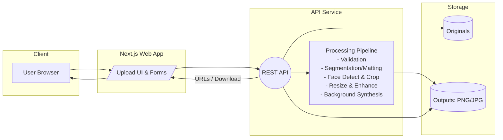

# AI Photo Generator

End-to-end service for generating compliant ID photos from user uploads. Demonstrates a practical workflow from raw uploads → background removal and face-aligned cropping → standardized outputs → an API + optional web UI.

## Problem

Given a user portrait, produce ID-compliant photos in standard sizes (e.g., 2x2 inch, 35x45 mm) with configurable background colors and quality enhancements. Provide both a developer-friendly API and a simple web UI.

## What This Repo Shows

- Reproducible image pipeline: ingestion, validation, matting/segmentation, face detection/crop, background synthesis, resizing, export.
- Multiple matting/segmentation models (e.g., MODNet, RMBG, BiRefNet) and face detection backends (MTCNN/RetinaFace/Face++).
- Node.js API service and a Next.js frontend.
- Local/run-anywhere setup with optional Docker, plus GPU acceleration path (onnxruntime-gpu in Python-based pipelines if used).

## Architecture

- See `docs/architecture.mmd` for the Mermaid source, or export to `docs/architecture.png` (instructions below).



## Repository Structure

- `ai_id_photo_backend_api/` — backend API (processing + endpoints)
- `ai_id_photo_web_app/` — Next.js web client
- `scripts/` — helper scripts and utilities (optional)
- `docs/` — diagrams and extra docs

## Tech Stack

- Backend: Node.js (Express), with optional bridge to Python models
- Processing: Background removal/segmentation + face detection/cropping
- Frontend: Next.js, TypeScript
- Infra: Docker / Docker Compose (optional), `.env`-based configuration

## Quick Start

Prereqs
- Node.js LTS and npm
- OS: Linux / macOS / Windows

### Backend (Node.js)

From repo root:

```bash
cd ai_id_photo_backend_api
npm install

# Development server (choose one)
node server.js
# or
nodemon server.js
```

- Default local base URL: `http://localhost:4000`
- See `ai_id_photo_backend_api/README_Backend.md` for details and troubleshooting (e.g., `node-fetch` v2).

### Frontend (Next.js)

From repo root:

```bash
cd ai_id_photo_web_app
npm install
```

Create `.env.development` in `ai_id_photo_web_app/`:

```env
NEXT_PUBLIC_REACT_APP_BASE_API_URL=http://localhost:4000
NEXT_PUBLIC_GOOGLE_CLIENT_ID=your-google-client-id
```

Run locally:

```bash
npm run dev
# Open http://localhost:3000
```

For remote backend:

```bash
npm run build
npm run start
```

### Docker (optional)

If you containerize services, add Dockerfiles and compose files. Example commands:

```bash
docker compose up --build
```

## API Reference (example)

Adjust paths/fields to match your backend:

- POST `/api/v1/generate`
  - multipart/form-data: `file=@<image>`, `bg_color=white|blue|red`, `size=2x2|35x45`, `dpi=300`, `enhance=true|false`
  - Returns: `{ job_id, status }` (async) or `{ outputs: [urls...] }` (sync)
- GET `/api/v1/jobs/{job_id}` → `{ status, outputs }`
- GET `/api/v1/templates` → supported sizes/DPI/backgrounds
- GET `/health` → `{ status: "ok" }`

Example (sync):

```bash
curl -X POST http://localhost:4000/api/v1/generate \
  -F "file=@/path/to/photo.jpg" \
  -F "bg_color=white" \
  -F "size=35x45" \
  -F "dpi=300"
```

## Exporting the Architecture Image

You can export the Mermaid diagram to PNG/SVG:

```bash
# Install Mermaid CLI
npm install -g @mermaid-js/mermaid-cli

# Export to PNG
mmdc -i docs/architecture.mmd -o docs/architecture.png
```

Then reference it in this README as:

```markdown

```

## Development

- Linting/formatting/testing per each app’s README
- Use environment files (`.env`, `.env.development`) to configure ports, CORS, and credentials

## Roadmap

- Batch jobs and webhooks
- Improved face alignment and compliance validators
- More country-specific templates and localized UI
- Signed URLs and access control for outputs

## License & Acknowledgments

- Choose a license (e.g., MIT) and include at repo root
- Acknowledge upstream models and datasets (MODNet, RMBG, BiRefNet, RetinaFace, MTCNN, Face++, etc.)

## Docker Compose Example

A ready-to-run Compose file is included at `docker-compose.yml`.

- Start backend only (port 4000):
  ```bash
  docker compose up backend
  # Visit http://localhost:4000
  ```

- Start backend + frontend:
  ```bash
  docker compose up
  # Backend: http://localhost:4000
  # Frontend: http://localhost:3000
  ```

Compose uses Node 18 Alpine images and mounts your source folders into the containers, running `npm install` then the dev commands. For production, prefer building dedicated images and using `npm ci`.

## API Docs

See `docs/api.md` for endpoint details and example requests.
